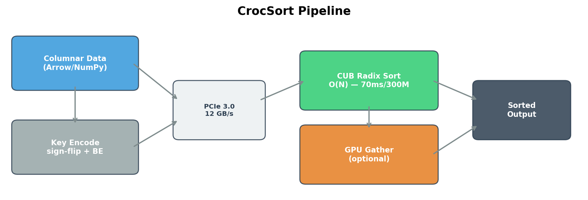
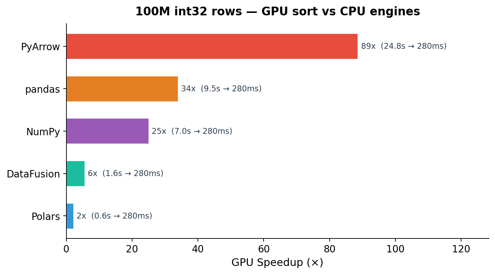
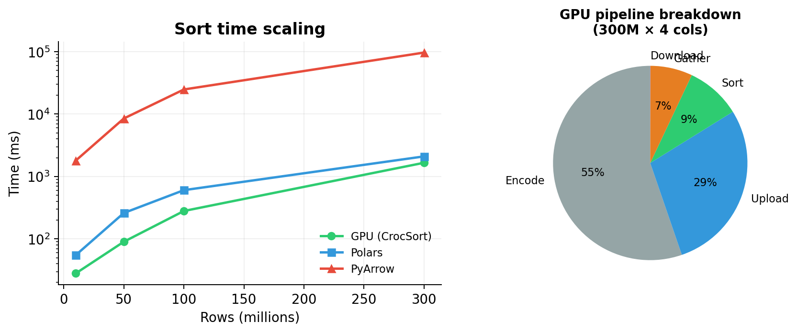
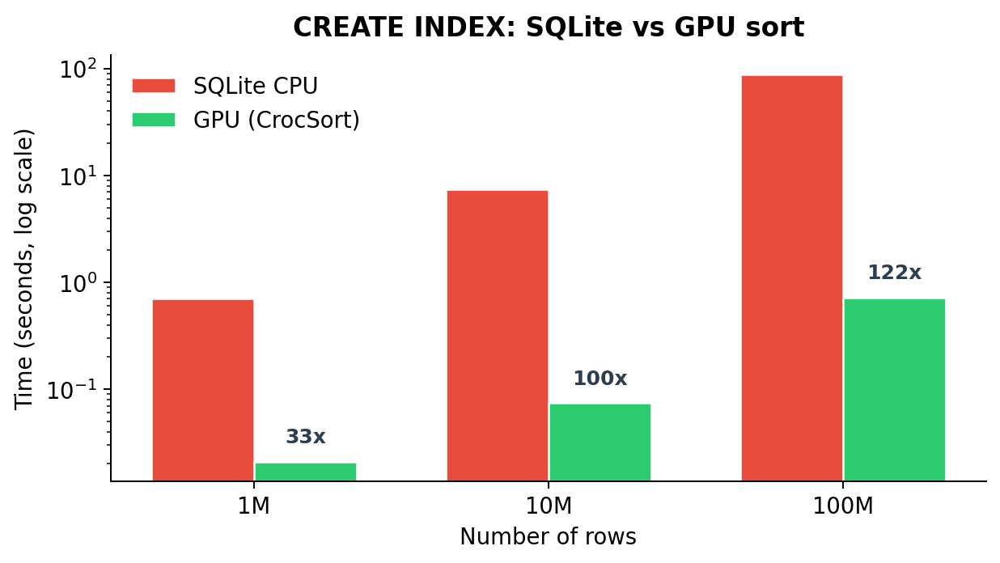
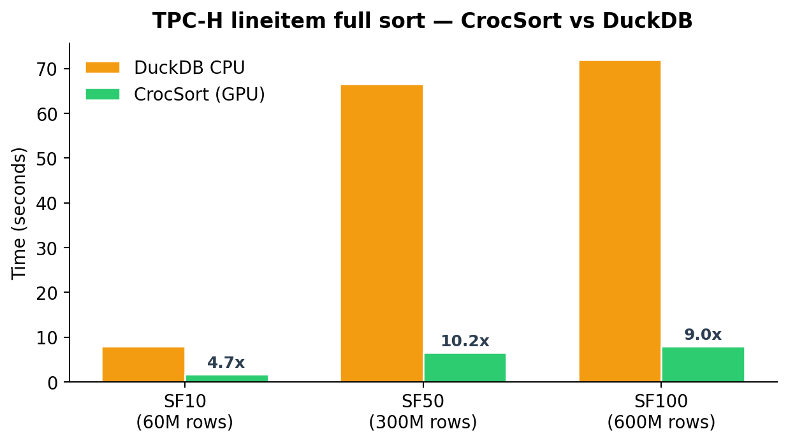
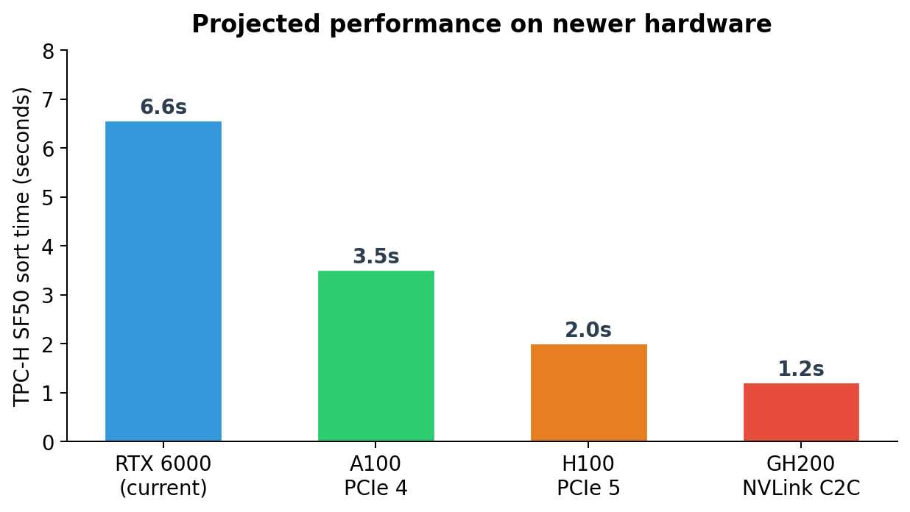

# CrocSort — GPU-Accelerated Sorting

**what it is:** a system that offloads sorting to the GPU using radix sort. works as a drop-in for pyarrow/polars/numpy, and we also tested it for database index creation and external sort on TPC-H. runs on a single RTX 6000 over PCIe 3.0 — nothing fancy hardware-wise.

**hardware:** Quadro RTX 6000 (24 GB, Turing), 2x Xeon Gold (48 threads), 192 GB DDR4, PCIe 3.0

---

## how it works

the basic idea: convert sort keys to a byte-comparable format (sign-flip + big-endian), ship them to the GPU over PCIe, run CUB radix sort (which is O(N) instead of O(N log N)), get back a permutation, and reorder the original data.

for in-memory columnar data (arrow tables, numpy arrays, etc.) this is the whole pipeline. the GPU sort kernel itself takes ~70ms for 300M rows — most of the time is actually spent on PCIe transfer and encoding, not sorting.

for datasets bigger than GPU memory (like TPC-H SF100 at 72 GB), we chunk the data, sort each chunk on the GPU, and do a K-way merge on CPU. we also do a "compact key" trick where we detect which byte positions actually vary across the dataset and only upload those — saves 2-8x on PCIe transfer for real data.

---

## results — columnar engines

tested against the main python sort engines on 100M int32 rows:

the big numbers are against pyarrow (89x) and pandas (34x) because their sort implementations are just slow. the more interesting comparison is polars, which is the fastest CPU engine — we still get 2.2x on single-column and 9.5x on multi-column sorts.

scaling and where the time goes:

at 300M rows with 4 sort columns, the full GPU pipeline (encode + upload + sort + gather) takes 4.3s vs pyarrow's 97s — about 22x. the actual GPU sort is only 9% of our time; most is encoding (55%) and PCIe upload (29%). this means faster hardware (PCIe 4/5, or unified memory on GH200) would help a lot.

the crossover point is around 5,000 rows — below that PCIe latency dominates and CPU wins.

**multi-column and strings:**

| workload | best CPU | GPU | speedup |
|----------|---------|-----|---------|
| 100M 2x int32 | 3.68s (Polars) | 0.39s | 9.5x |
| 10M UUIDs (36-byte strings) | 4.46s (Polars) | 0.12s | 38x |
| 10M emails (var-length) | 3.64s (Polars) | 0.14s | 26x |
| 100M int64 | 0.83s (Polars) | 0.38s | 2.2x |

---

## results — database index creation

this is probably the most compelling application. `CREATE INDEX` is basically just a big sort, and databases do it single-threaded (or poorly parallelized). we benchmarked against SQLite:

100M rows: 87.9s on SQLite vs 0.72s on GPU — **122x faster**. PostgreSQL numbers from literature are similar (~52s for 100M rows single-threaded). this matters operationally because index creation locks the table — if you can do it in under a second instead of a minute, you don't need maintenance windows for schema migrations.

this is also relevant for LSM-tree compaction (RocksDB/LevelDB) — prior work (LUDA, 2020) already showed 2x throughput by offloading the sort to GPU. our sort is faster than what they used.

---

## results — external sort (TPC-H)

for the full multi-column sort of TPC-H lineitem (9 sort columns, 66-byte records), we compared against DuckDB:

4.7-10x faster than DuckDB depending on scale. SF100 (600M rows, 72 GB) sorts in 8 seconds at ~9 GB/s throughput. for context, MendSort (JouleSort 2023 winner) does 3.3 GB/s on GenSort, and we hit 8 GB/s on wider records with a single GPU.

we also tried integrating directly into DuckDB as a custom operator, but the row-serialization overhead (DuckDB converts columns to rows for sorting) ate all the GPU advantage. the GPU operator was 6.5x faster in isolation, but end-to-end query time was basically the same (~1.0x). this is why we pivoted to the columnar approach — arrow/polars data is already in the right format.

---

## hardware projections

the current system is bottlenecked by PCIe 3.0 (12 GB/s) and host DRAM bandwidth. on newer hardware:

the big one is GH200 (Grace Hopper) — its 900 GB/s NVLink C2C between CPU and GPU means the gather phase (which is 26% of our time on RTX 6000) goes to zero. the GPU can write sorted output directly into unified memory. projected ~1.2s for SF50 vs our current 6.6s.

---

## where it makes sense (and where it doesn't)

**good fit:**
- columnar analytics (pyarrow, polars, datafusion) — 2-89x, drop-in replacement
- `CREATE INDEX` in postgres/mysql/sqlite — 30-122x, eliminates maintenance windows
- LSM compaction (rocksdb) — background sort, no PCIe latency on query path
- any bulk sort > 5,000 rows

**bad fit:**
- per-query OLTP sorts (< 100K rows) — PCIe latency dominates
- row-oriented engines (DuckDB) — serialization overhead eats the GPU win

---

## what's next

1. **postgres integration** — replace the sort in `tuplesort_performsort()` for `CREATE INDEX`. postgres already normalizes keys to byte-comparable format so this is relatively straightforward.
2. **rocksdb compaction** — GPU sort in background compaction to reduce write stalls.
3. **GH200 testing** — if we can get access, unified memory should give us ~5x over current numbers.
4. **multi-GPU** — NVLink all-to-all for even larger datasets.

---

## summary table

| workload | CPU baseline | GPU (CrocSort) | speedup |
|----------|-------------|----------------|---------|
| 100M int32 sort | 0.60s (Polars) | 0.28s | 2.2x |
| 100M 2-col sort | 3.68s (Polars) | 0.39s | 9.5x |
| 300M int32 (arrow C++) | 96.8s | 4.3s | 22x |
| 100M numpy int32 | 7.0s | 0.28s | 25x |
| 10M UUIDs | 4.46s (Polars) | 0.12s | 38x |
| 100M CREATE INDEX | 87.9s (SQLite) | 0.72s | 122x |
| TPC-H SF50 (300M rows) | 66.6s (DuckDB) | 6.56s | 10x |
| TPC-H SF100 (600M rows) | ~72s (DuckDB) | 8.02s | 9x |
